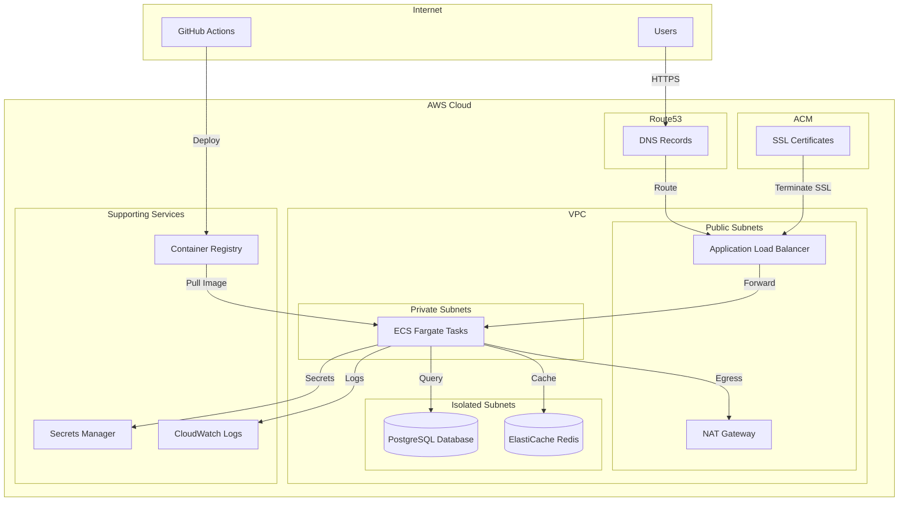
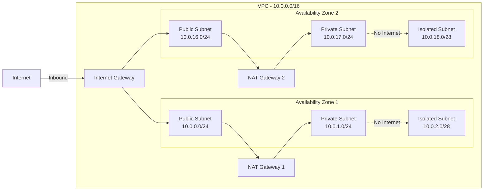
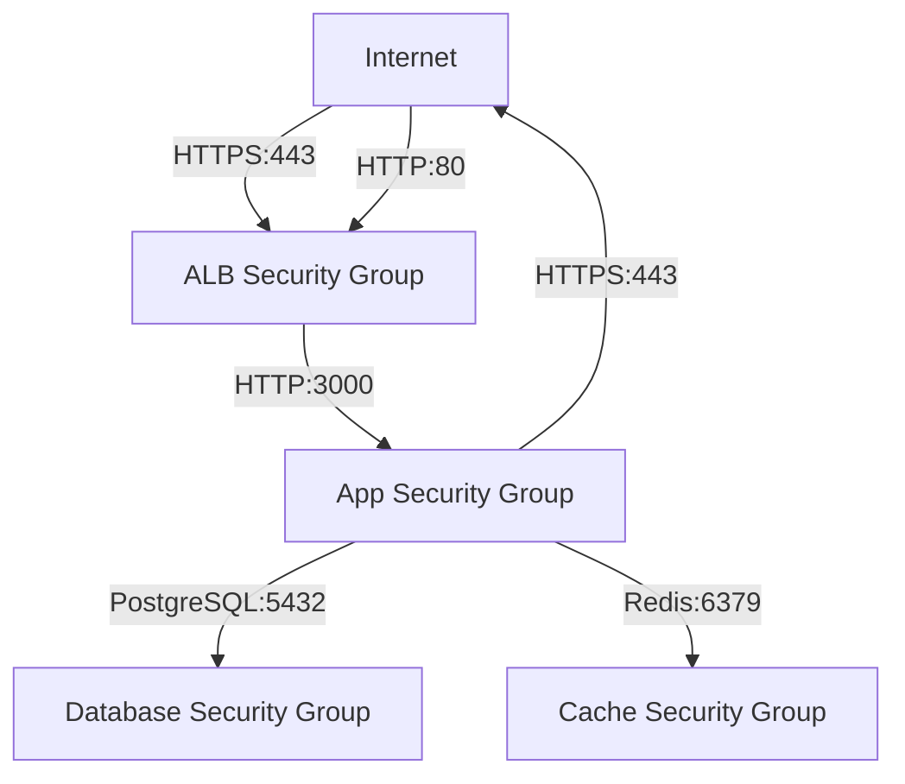
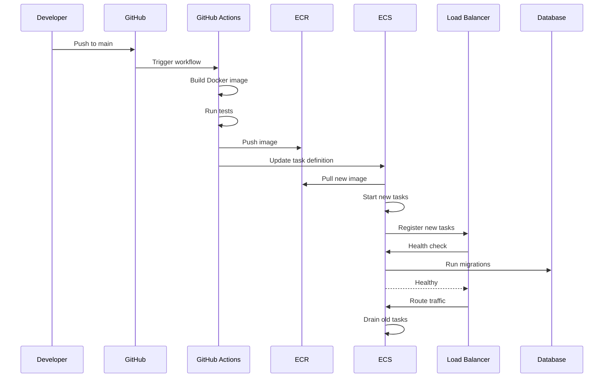
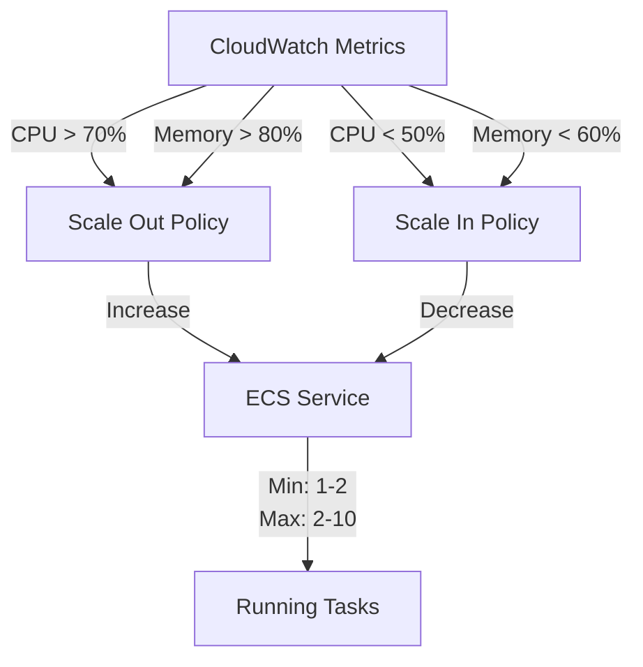
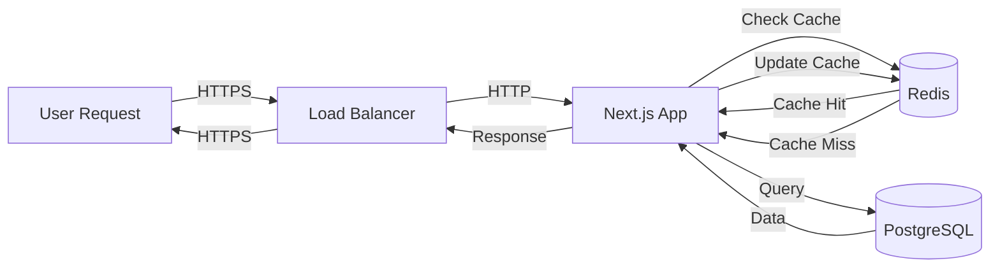
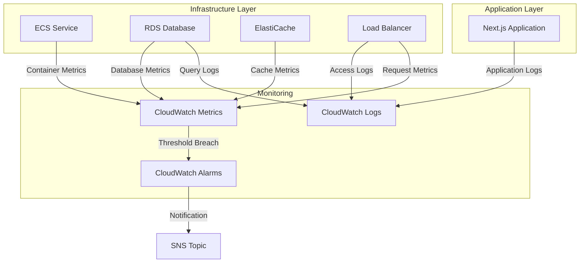
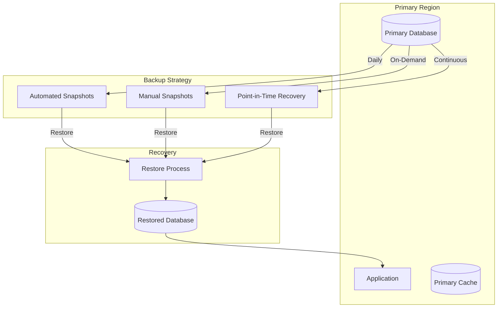
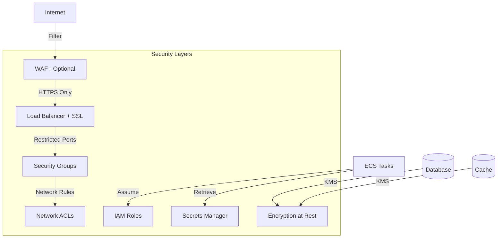

# Infrastructure Architecture

## High-Level Architecture

## Network Architecture

## Security Groups

## Deployment Flow

## Auto-Scaling Architecture

## Data Flow

## Monitoring and Logging

## Disaster Recovery

## Cost Breakdown

### Development Environment (~$50-100/month)

| Service | Instance Type | Monthly Cost |
|---------|--------------|--------------|
| RDS PostgreSQL | db.t4g.micro | ~$15 |
| ElastiCache Redis | cache.t4g.micro | ~$12 |
| ECS Fargate | 0.5 vCPU, 1GB | ~$15-30 |
| NAT Gateway | 1 gateway | ~$32 |
| Application Load Balancer | - | ~$16 |
| Data Transfer | Minimal | ~$5 |

### Production Environment (~$200-400/month)

| Service | Instance Type | Monthly Cost |
|---------|--------------|--------------|
| RDS PostgreSQL | db.t4g.small (Multi-AZ) | ~$60 |
| ElastiCache Redis | cache.t4g.small | ~$24 |
| ECS Fargate | 1 vCPU, 2GB (2-10 tasks) | ~$60-180 |
| NAT Gateway | 2 gateways | ~$64 |
| Application Load Balancer | - | ~$16 |
| Data Transfer | Moderate | ~$20 |

## Scalability Limits

### Current Configuration

| Resource | Development | Production |
|----------|-------------|------------|
| ECS Tasks | 1-2 | 2-10 |
| Database | Single-AZ | Multi-AZ |
| Database Storage | 20-100 GB | 100-500 GB |
| Cache Nodes | 1 | 1 |
| NAT Gateways | 1 | 2 |

### Scaling Considerations

1. **Horizontal Scaling**: ECS tasks can scale from 2 to 10 (production)
2. **Vertical Scaling**: Database and cache can be upgraded to larger instance types
3. **Database Scaling**: Can migrate to Aurora for better scalability
4. **Cache Scaling**: Can add read replicas or use Redis Cluster mode
5. **Multi-Region**: Can deploy to multiple regions for global distribution

## Security Architecture

## High Availability

### Development
- Single AZ deployment
- Single NAT Gateway
- Automated backups (1 day retention)
- Manual failover required

### Production
- Multi-AZ deployment
- Dual NAT Gateways
- Automated backups (7 day retention)
- Automatic failover for database
- Multiple ECS tasks across AZs
- Load balancer health checks

## Performance Optimization

1. **Caching Strategy**
   - Redis for session storage
   - Redis for frequently accessed data
   - CloudFront CDN (optional, not included)

2. **Database Optimization**
   - Connection pooling in application
   - Read replicas (can be added)
   - Query optimization and indexing

3. **Application Optimization**
   - Next.js static generation
   - Image optimization
   - Code splitting and lazy loading

4. **Network Optimization**
   - Keep-alive connections
   - HTTP/2 support via ALB
   - Compression enabled
