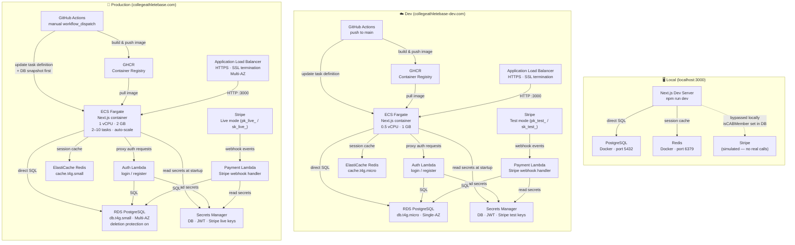
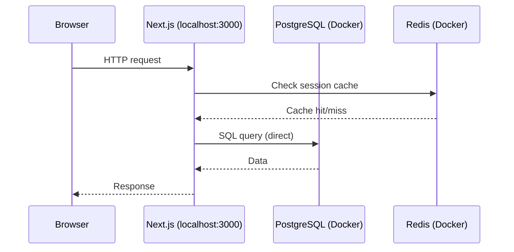
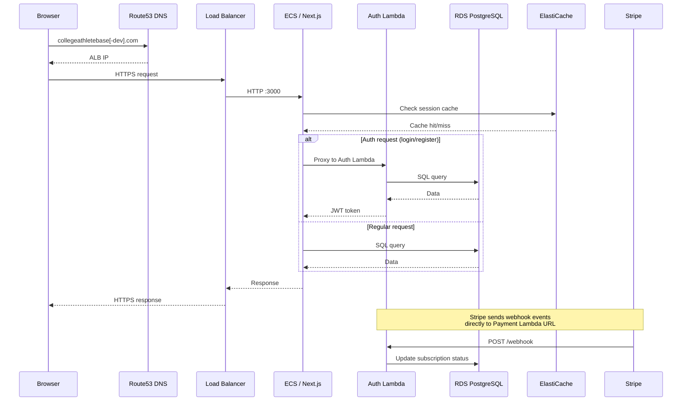
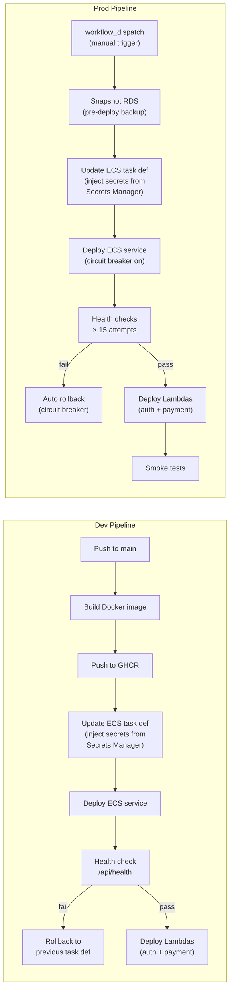
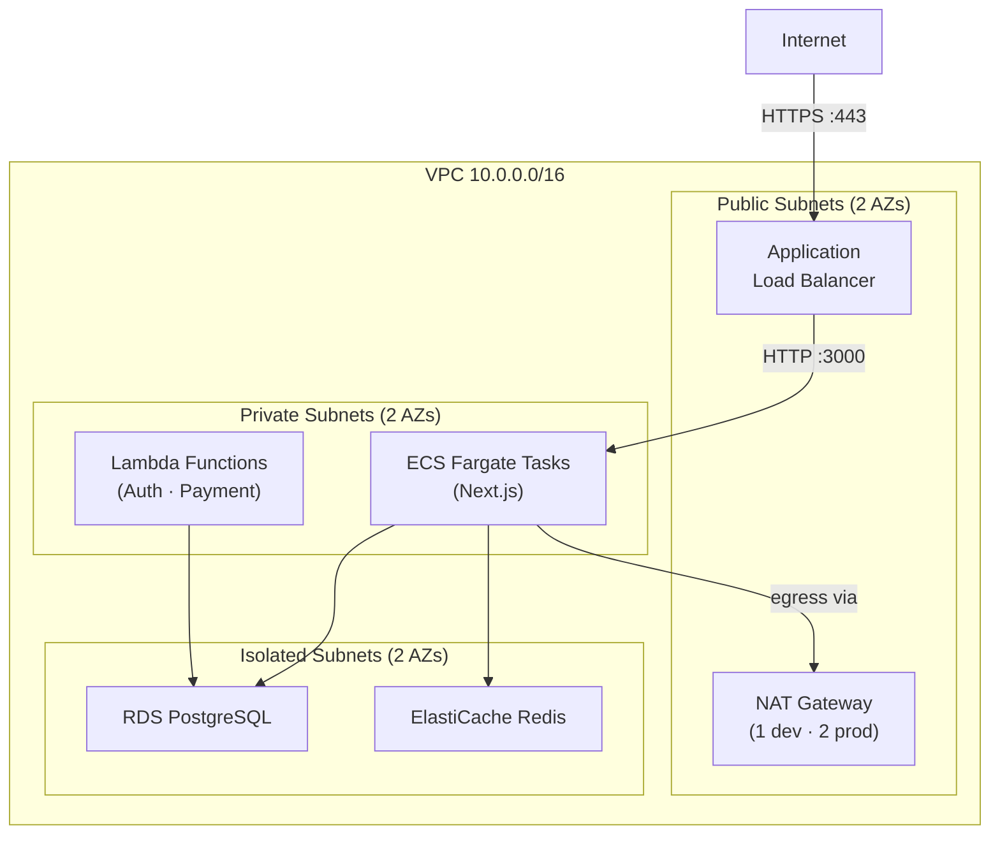

# Environment Architecture

This document shows how the app runs across all three environments: local, dev, and production.

---

## Overview

---

## Environment Comparison

| | Local | Dev | Production |
|---|---|---|---|
| URL | `localhost:3000` | `collegeathletebase-dev.com` | `collegeathletebase.com` |
| Next.js | `npm run dev` (hot reload) | ECS Fargate (0.5 vCPU / 1 GB) | ECS Fargate (1 vCPU / 2 GB, 2–10 tasks) |
| Database | Docker PostgreSQL | RDS `db.t4g.micro` Single-AZ | RDS `db.t4g.small` Multi-AZ |
| Redis | Docker Redis | ElastiCache `cache.t4g.micro` | ElastiCache `cache.t4g.small` |
| Auth | Direct DB (no Lambda) | Auth Lambda | Auth Lambda |
| Payments | Simulated (no Stripe) | Stripe test keys | Stripe live keys |
| Secrets | `.env.local` file | AWS Secrets Manager | AWS Secrets Manager |
| Deployments | Manual (`npm run dev`) | Auto on push to `main` | Manual `workflow_dispatch` |
| DB backups | None | 1-day retention | 7-day retention + pre-deploy snapshot |
| Rollback | N/A | Manual (previous task def) | Automatic (circuit breaker) |

---

## Request Flow

### Local

### Dev & Production

---

## CI/CD Flow

---

## Network Layout (Dev & Production)

---

## Key Differences: Local vs Cloud

**What's bypassed locally:**
- No AWS — everything runs in Docker
- No Auth Lambda — Next.js talks to the DB directly for auth
- No Stripe — a simulation button sets `isCABMember=true` in the local DB
- No Secrets Manager — credentials come from `.env.local`
- `RUNTIME_ENV=local` is the flag the app checks to switch between these modes

**What changes between Dev and Prod:**
- Stripe switches from test keys (`pk_test_`) to live keys (`pk_live_`)
- RDS goes from Single-AZ to Multi-AZ with deletion protection
- ECS scales from 1 task to 2–10 tasks with auto-scaling
- Production deployments require a manual trigger and take a DB snapshot first
- Production has an automatic circuit-breaker rollback; dev does a manual rollback
